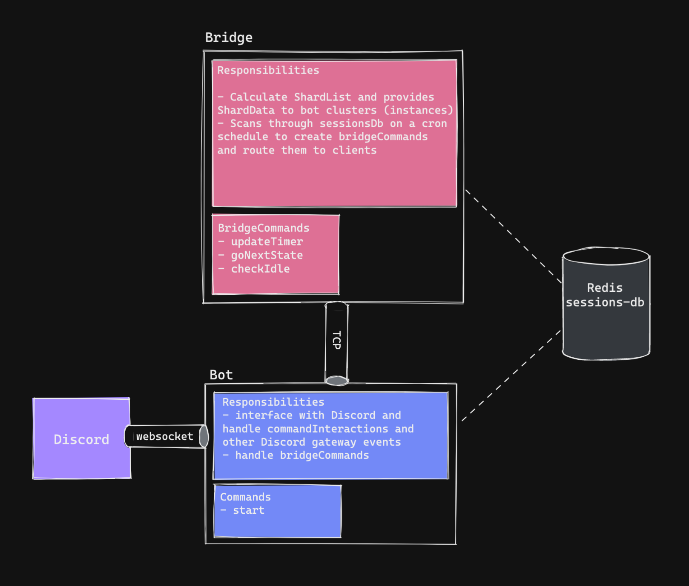

## Design

## Requirements

- npm v8.19.1
- node v18.9.0
- libtool v2.4.6
- ffmpeg

## Deployment

1. configure config/\*.json files, `npm i`, and run vscode task `tsc: build - all`
2. `npm run register-commands` in "./ts/pomomo-bot"
3. `npm run prod` in "./ts/pomomo-bridge"
4. `npm run prod` in "./ts/pomomo-bot"
