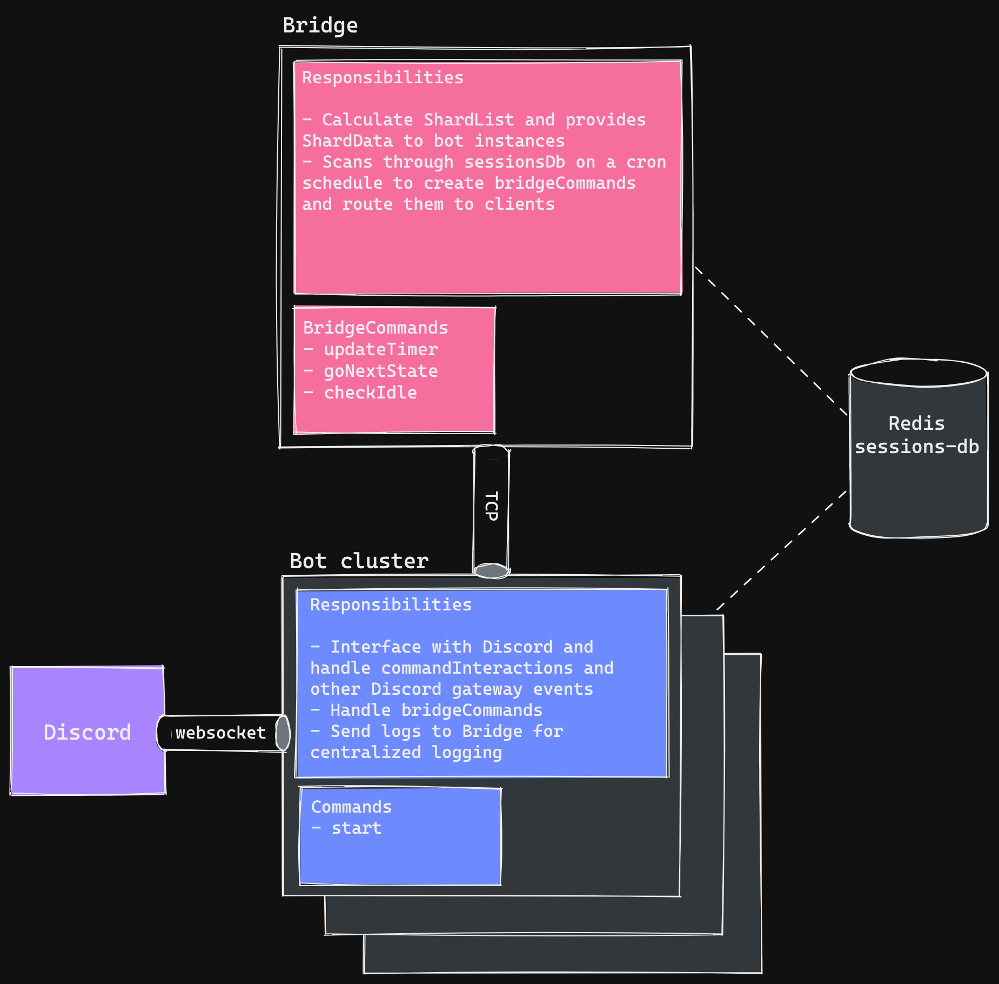

**Pomodoro bot that helps keep you and your friends on track while you study together!**

Pomomo uses the proven pomodoro technique which alternates periods of work and relaxation to maximize productivity while minimizing burnout.

Customize the settings to what works best for you, and Pomomo will play an alert in your voice channel for each interval!

## Usage

[Click here](https://discord.com/oauth2/authorize?client_id=821952460909445130&permissions=15739904&scope=bot%20applications.commands) to invite Pomomo to your Discord server.

To start a pomodoro session, join a voice channel and use slash command `/start`. It's that simple!

Visit [pomomo.us](https://pomomo.us) or join the [support server](https://discord.gg/Aghy78wcFr) for more info!

## Design

## Requirements

- npm v8.19.1
- node v18.9.0
- libtool v2.4.6
- ffmpeg

## Deployment

1. configure config/\*.json files, execute `npm i`
2. if slash commands have been added or removed, execute `npm run register-commands` from "./ts/pomomo-bot"
3. execute `pm2 start bridge.json` from "./deploy" to start Bridge
4. execute `pm2 start bot.json` from "./deploy" to start Bot Client
